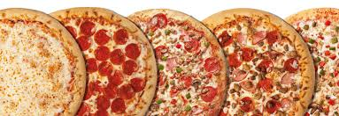
# Pizza_Sales_Analysis_Using_SQL_and_Excel

## Project Overview
The Pizza Sales Analysis project aims to analyze and visualize the sales data of a pizza business. The analysis helps identify key performance indicators (KPIs), sales trends, and top-performing products. The project leverages SQL for data extraction and Excel for data cleaning, processing, and visualization. The final output is a comprehensive dashboard that provides actionable insights for business decision-making.

### Tools and Software Used
-	Microsoft Office/ Excel – 2019
-	MS SQL Server 19
-	Microsoft SQL Server Management Studio – 19.2

### Key Performance Indicators (KPIs)
**Total Revenue**
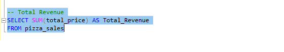

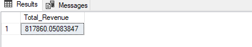

**Average Order Value**
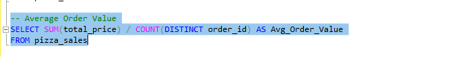

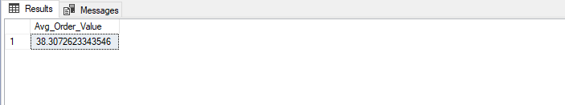

**Total Pizzas Sold**
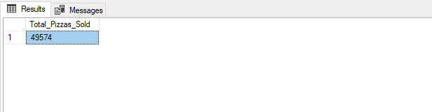

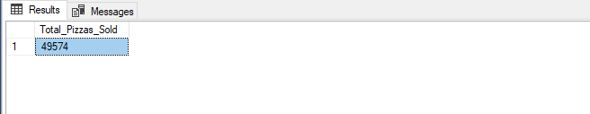

**Total Orders**
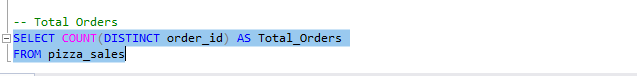

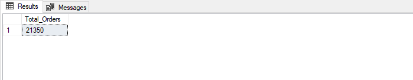

**Average Pizzas Per Order**
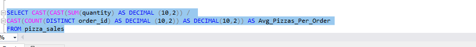

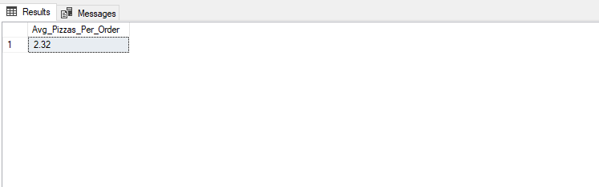

### Charts and Visualizations Requirements
**Daily Trend for Total Orders**
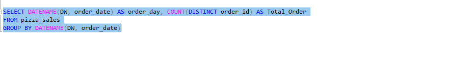

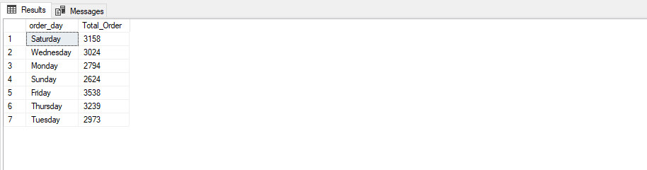

**Hourly Trend**
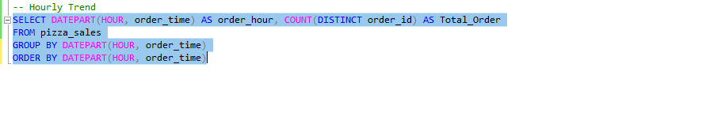

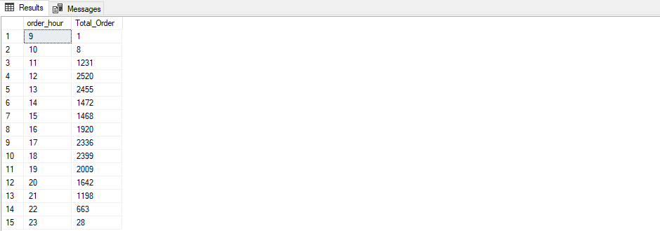

**% of Sales by Pizza Category**
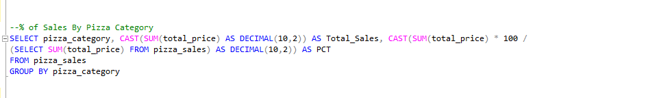

**% of Sales by Pizza Size**
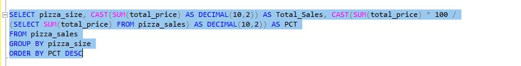

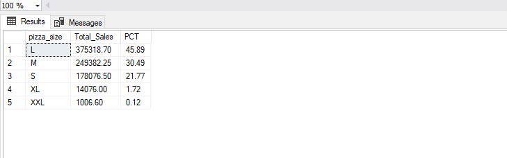

**Total Pizzas Sold by Pizza Category**
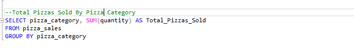

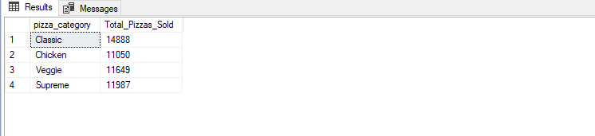

**Top 5 Best Sellers by Total Pizzas Sold**
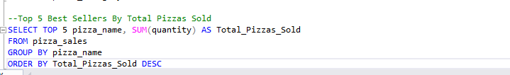

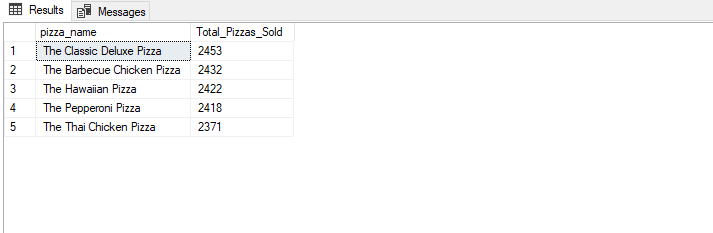

**Bottom 5 Worst Sellers by Total Pizzas Sold**
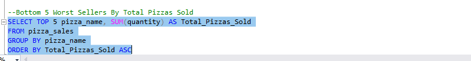

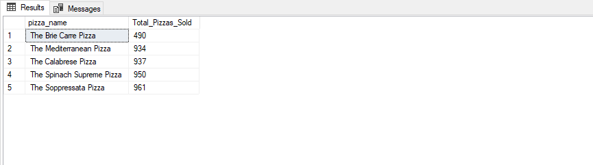

### Data Cleaning and Visualization in Excel
After performing the SQL queries to extract and calculate the necessary data, the information was imported into Excel for further data cleaning, processing, and visualization.

## Dashboard
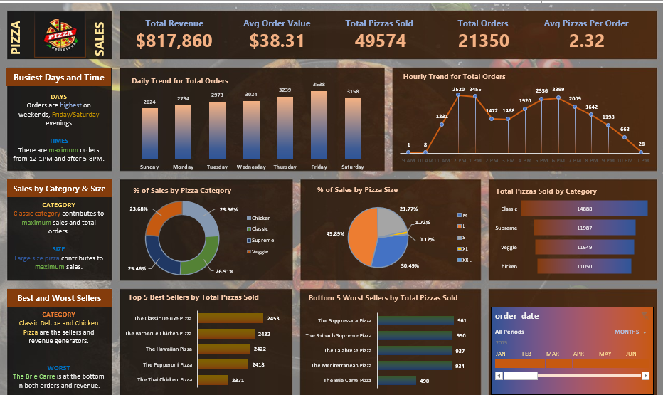

## Dashboard Insights
### Key Metrics
-	**Total Revenue:** $817,860
-	**Average Order Value:** $38.31
-	**Total Pizzas Sold:** 49,574
-	**Total Orders:** 21,350
-	**Average Pizzas Per Order:** 2.32
### Busy Days and Times
-	**Days:** Orders are highest on weekends, especially Friday and Saturday.
-	**Times:** Peak order times are from 12-1 PM and after 5-8 PM.
### Sales by Category and Size
-	**Category:** Classic category contributes to the highest sales.
	**Size:** Large size pizzas contribute significantly to total sales.
### Best and Worst Sellers
-	**Best Sellers:** Classic Deluxe and Chicken Pizza are the top sellers.
-	**Worst Sellers:** Brie Carre is the least sold.

## Conclusion
The Pizza Sales Analysis project effectively visualizes the sales data, providing clear insights into trends, top-selling products, and peak sales times. These insights can help in making strategic business decisions, such as optimizing inventory, improving marketing strategies, and enhancing customer satisfaction.
